# 🚀 AUY1104 - Evaluación Final Transversal

# Pipeline CI/CD con Estrategia Blue-Green sobre Kubernetes (K3s)

> Evaluación desarrollada para la asignatura **Ciclo de Vida del Software II**, implementando un pipeline CI/CD reutilizable mediante **GitHub Actions**, una estrategia de despliegue **Blue-Green**, validaciones automáticas de salud y mecanismos de remediación sobre un clúster **Kubernetes K3s** ejecutándose sobre Amazon EC2.

---

# 👨‍🎓 Información General

| Campo | Información |
|-------|-------------|
| **Estudiante** | Lucía Villalobos |
| **Asignatura** | CICLO DE VIDA DEL SOFTWARE II_002V |
| **Evaluación** | Evaluación Final Transversal |
| **Docente** | Andrés Patricio Sánchez Ossandón |
| **Tecnologías** | GitHub Actions, Docker, Docker Hub, Kubernetes (K3s), Amazon EC2, Node.js, Git, Visual Studio Code |
| **Proveedor Cloud** | Amazon Web Services (AWS) |

---

# 📑 Contenido

- 🎯 [Objetivo](#-objetivo)
- 🏗️ [Arquitectura implementada](#️-arquitectura-implementada)
- 🛠️ [Tecnologías utilizadas](#️-tecnologías-utilizadas)
- 📁 [Estructura del proyecto](#-estructura-del-proyecto)
- ⚙️ [Workflow reutilizable](#️-workflow-reutilizable)
- 🔵🟢 [Estrategia Blue-Green](#-estrategia-blue-green)
- 🩺 [Validaciones de salud](#-validaciones-de-salud)
- 🔄 [Rollback automático](#-rollback-automático)
- 📸 [Evidencias de implementación](#-evidencias-de-implementación)
- 📚 [Referencias](#-referencias)
- 🤖 [Declaración de uso de IA](#-declaración-de-uso-de-ia)
- ✅ [Conclusiones](#-conclusiones)

---

# 🎯 Objetivo

Desarrollar una solución de Integración y Entrega Continua (CI/CD) para el microservicio **TechMarket Orders**, utilizando **GitHub Actions** y un clúster **Kubernetes K3s**, implementando una estrategia de despliegue **Blue-Green** que permita publicar nuevas versiones de la aplicación con alta disponibilidad, validaciones automáticas de salud y un mecanismo de recuperación automática (Rollback) frente a posibles fallos durante el proceso de despliegue.

El proyecto reutiliza las plantillas desarrolladas durante el semestre, automatizando las etapas de construcción, publicación, despliegue y validación de la aplicación, reduciendo el riesgo asociado a las actualizaciones en producción y garantizando la continuidad del servicio.

---

# 🏗️ Arquitectura implementada

La solución desarrollada implementa un pipeline de Integración y Entrega Continua (CI/CD) para el microservicio **TechMarket Orders**, utilizando un clúster **Kubernetes K3s** desplegado sobre una instancia **Amazon EC2**.

La automatización fue desarrollada mediante **GitHub Actions**, reutilizando los workflows creados durante el semestre para ejecutar las etapas de pruebas, construcción de la imagen Docker, publicación en Docker Hub y despliegue automatizado sobre Kubernetes.

La estrategia de despliegue seleccionada fue **Blue-Green**, permitiendo mantener dos ambientes independientes (**Blue** y **Green**) y cambiar el tráfico entre ellos mediante el Service de Kubernetes únicamente después de validar correctamente el estado de la nueva versión.

La arquitectura implementada se compone de los siguientes elementos:

- Repositorio principal **AUY1104-Client**, que contiene el código fuente, manifiestos Kubernetes y workflow principal.
- Repositorio **AUY1104-SharedWorkflows**, que almacena los workflows reutilizables.
- GitHub Actions como plataforma de automatización CI/CD.
- Docker Hub como registro de imágenes Docker.
- Amazon EC2 ejecutando un clúster Kubernetes K3s.
- Dos Deployments independientes (Blue y Green).
- Un Service de Producción.
- Un Service Preview para validar la nueva versión antes de su promoción.
- Health Checks automáticos mediante el endpoint `/health`.
- Rollback automático en caso de error durante la validación.

> **Nota:** Aunque el enunciado original hace referencia a Amazon EKS y Amazon ECR, durante el desarrollo se utilizó la infraestructura trabajada durante el semestre (K3s sobre EC2 y Docker Hub), de acuerdo con la aclaración entregada por el docente.

---

# 🛠️ Tecnologías utilizadas

| Tecnología | Función dentro del proyecto |
|------------|-----------------------------|
| Git | Control de versiones del proyecto. |
| GitHub | Almacenamiento del código fuente y ejecución del pipeline CI/CD. |
| GitHub Actions | Automatización de pruebas, construcción, publicación y despliegue. |
| Docker | Contenerización del microservicio. |
| Docker Hub | Registro de imágenes Docker utilizadas por Kubernetes. |
| Kubernetes (K3s) | Orquestación de contenedores y estrategia Blue-Green. |
| Amazon EC2 | Infraestructura donde se ejecuta el clúster K3s. |
| Node.js | Desarrollo del microservicio TechMarket Orders. |
| Visual Studio Code | Desarrollo y administración del código fuente. |

---

# 📁 Estructura del proyecto

El desarrollo se organizó utilizando dos repositorios independientes para facilitar la reutilización de componentes y mantener una arquitectura modular.

## Repositorio AUY1104-Client

Contiene:

- Código fuente del microservicio.
- Dockerfile.
- Workflows principales.
- Manifiestos Kubernetes.
- Documentación y evidencias.

## Repositorio AUY1104-SharedWorkflows

Contiene:

- Workflows reutilizables mediante `workflow_call`.
- Automatización del despliegue Blue-Green.
- Construcción y publicación de imágenes.
- Validaciones automáticas.
- Remediación automática (Rollback).

---

# ⚙️ Workflow reutilizable

Uno de los principales objetivos de esta evaluación fue reutilizar los componentes desarrollados durante el semestre, evitando duplicar código y centralizando la lógica del proceso de Integración y Entrega Continua (CI/CD).

Para ello se utilizaron dos repositorios independientes:

- **AUY1104-Client:** contiene el código fuente de la aplicación y el workflow principal.
- **AUY1104-SharedWorkflows:** contiene el workflow reutilizable encargado de ejecutar todo el proceso de construcción, despliegue y validación.

El workflow principal invoca al workflow reutilizable mediante `workflow_call`, enviando como parámetros la imagen Docker, la etiqueta de versión y la dirección IP del servidor Kubernetes.

Esta arquitectura permite reutilizar el mismo pipeline para distintos proyectos, modificando únicamente los parámetros de entrada sin necesidad de duplicar la lógica de automatización.

## Flujo del pipeline

El workflow reutilizable ejecuta las siguientes etapas de manera secuencial:

1. Ejecución de pruebas automatizadas.
2. Construcción de la imagen Docker.
3. Publicación de la imagen en Docker Hub.
4. Conexión mediante SSH con la instancia EC2.
5. Detección automática del ambiente activo.
6. Selección del ambiente candidato.
7. Despliegue de la nueva versión.
8. Configuración dinámica del Service Preview.
9. Validación automática del endpoint `/health`.
10. Promoción del candidato a producción.
11. Validación final del servicio.
12. Rollback automático en caso de error.
13. Visualización del estado final del clúster.

## Beneficios de la reutilización

La utilización de un workflow reutilizable permitió:

- Centralizar la lógica del pipeline.
- Reducir la duplicación de código.
- Facilitar el mantenimiento del proceso CI/CD.
- Reutilizar la misma automatización en diferentes proyectos.
- Mantener una estructura modular y escalable.

### Evidencias

#### Workflow reutilizable completo

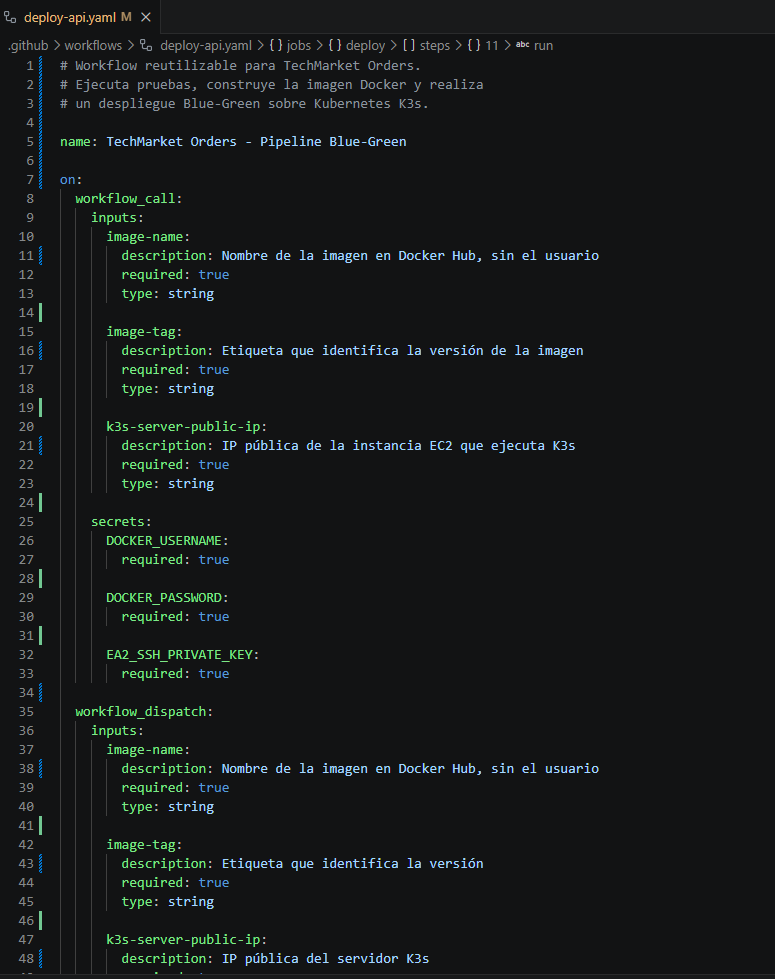

#### Detección automática del ambiente activo

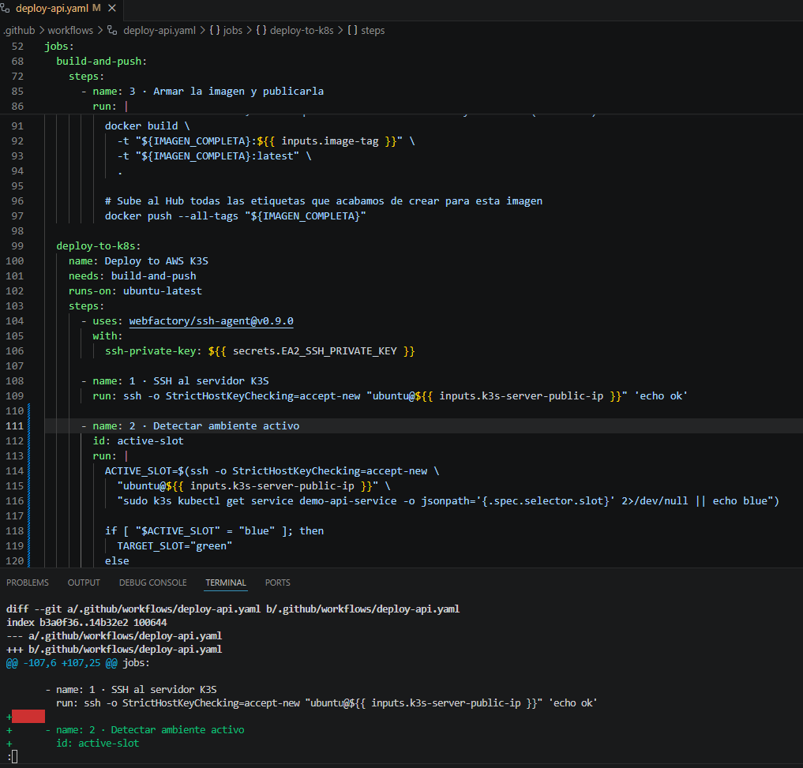

#### Configuración dinámica del Service Preview

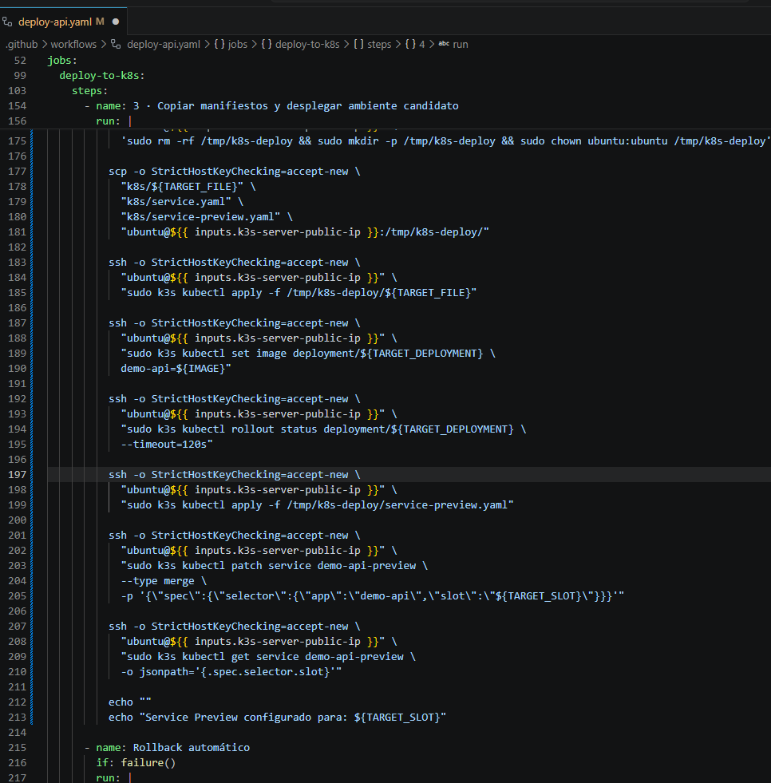

---

# 🔵🟢 Estrategia Blue-Green

La estrategia **Blue-Green Deployment** consiste en mantener dos ambientes de producción completamente independientes, permitiendo desplegar una nueva versión de la aplicación sin afectar la versión que actualmente atiende las solicitudes de los usuarios.

Durante esta evaluación se implementaron dos Deployments independientes:

- **Blue:** ambiente actualmente en producción.
- **Green:** ambiente candidato donde se despliega la nueva versión.

El cambio entre ambos ambientes no se realiza modificando los Deployments, sino actualizando el selector del **Service de Producción**, permitiendo cambiar el tráfico únicamente cuando la nueva versión supera todas las validaciones configuradas en el pipeline.

Esta estrategia reduce significativamente el riesgo de indisponibilidad durante una actualización y permite regresar rápidamente a la versión estable en caso de detectar algún problema.

## Componentes implementados

La solución incorpora los siguientes recursos de Kubernetes:

- Deployment Blue.
- Deployment Green.
- Service de Producción (`demo-api-service`).
- Service Preview (`demo-api-preview`).

El **Service Preview** permite validar el ambiente candidato antes de que reciba tráfico de producción, mientras que el **Service de Producción** únicamente cambia su selector una vez que el pipeline confirma que la nueva versión funciona correctamente.

---

## Funcionamiento del despliegue

El proceso implementado sigue el siguiente flujo:

```text
Cliente
    │
    ▼
Service Producción
    │
    ▼
Ambiente Blue (Producción)

GitHub Actions
        │
        ▼
Deployment Green
        │
        ▼
Service Preview
        │
        ▼
Health Check (/health)
        │
        ▼
¿Resultado correcto?

     Sí
      │
      ▼
Actualizar selector del Service
      │
      ▼
Green pasa a Producción

     No
      │
      ▼
Rollback automático
```

---

## Ventajas de la estrategia Blue-Green

La implementación desarrollada permite:

- Evitar interrupciones del servicio durante los despliegues.
- Validar la nueva versión antes de exponerla a los usuarios.
- Reducir el riesgo asociado a las actualizaciones.
- Facilitar el retorno inmediato a la versión estable.
- Mantener una alta disponibilidad de la aplicación.

---

## Evidencias

### Deployment Blue

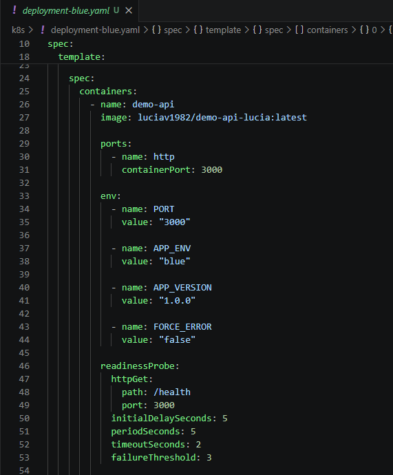

### Deployment Green

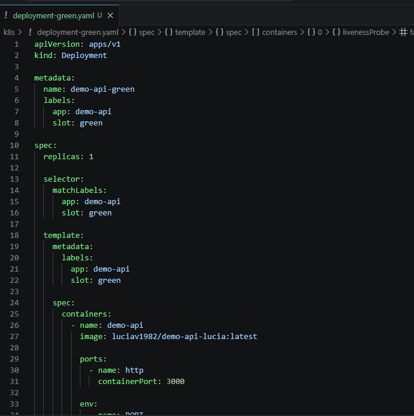

### Creación del Service Preview

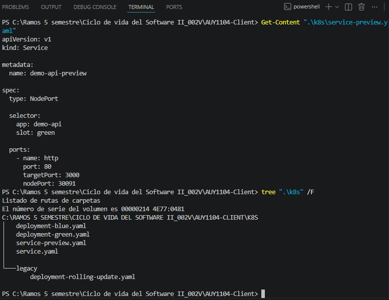

### Validación entre ambientes Blue y Green

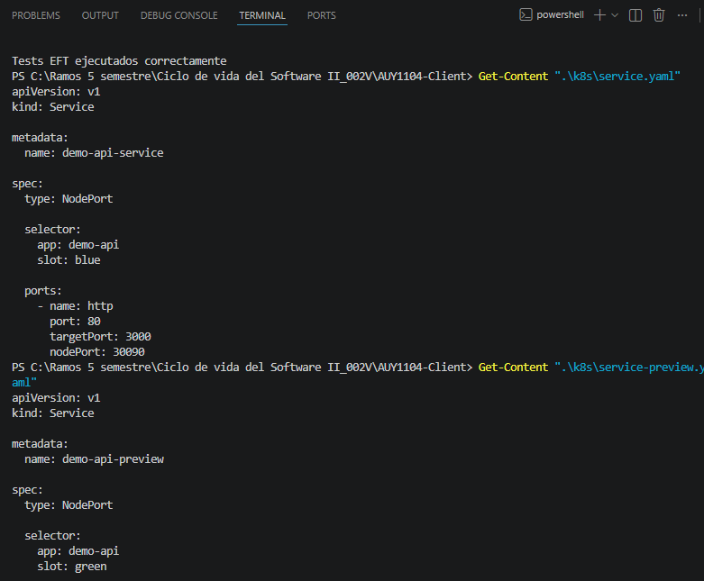

---

# 🩺 Validaciones de salud

Una de las mejoras implementadas respecto al despliegue tradicional fue la incorporación de validaciones automáticas antes de exponer una nueva versión de la aplicación al ambiente de producción.

El workflow ejecuta un **Health Check** sobre el ambiente candidato utilizando el endpoint `/health`, verificando que la aplicación responda correctamente antes de modificar el tráfico del Service de Producción.

Durante el desarrollo se implementaron múltiples intentos automáticos de validación, permitiendo que Kubernetes complete el despliegue antes de evaluar el estado de la aplicación. Esta mejora aumentó considerablemente la estabilidad del pipeline y evitó falsos errores durante la promoción.

## Flujo de validación

El proceso implementado sigue la siguiente secuencia:

1. Desplegar el ambiente candidato.
2. Configurar el Service Preview.
3. Ejecutar el endpoint `/health`.
4. Esperar la respuesta del servicio.
5. Si la respuesta es **HTTP 200**, continuar con la promoción.
6. Si la validación falla, activar el mecanismo de Rollback.

---

# 🚀 Promoción a producción

Una vez validado correctamente el ambiente candidato, el workflow modifica dinámicamente el selector del **Service de Producción** para dirigir el tráfico hacia la nueva versión.

Este procedimiento evita la interrupción del servicio y permite realizar despliegues de forma transparente para los usuarios.

Durante las pruebas realizadas se verificó el correcto funcionamiento tanto del despliegue inicial como de la transición entre los ambientes **Blue** y **Green**.

---

## Primera ejecución del pipeline

En la primera ejecución del workflow no existía un ambiente previamente desplegado.

El pipeline detectó esta condición y promovió automáticamente el ambiente **Blue** como primera versión de producción.

### Evidencias

#### Pipeline - Primer despliegue exitoso

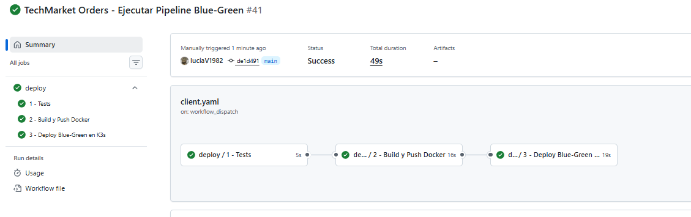

#### Detalle del primer despliegue

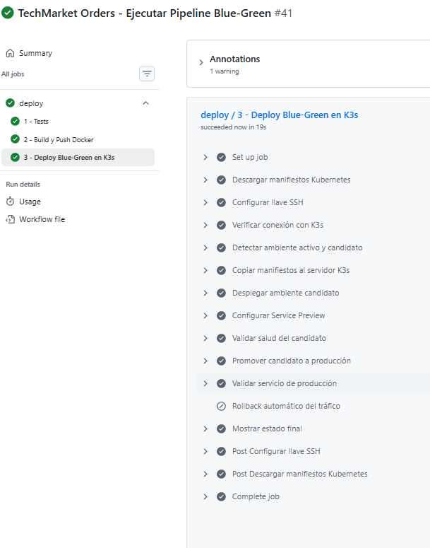

---

## Segunda ejecución del pipeline

Posteriormente se ejecutó nuevamente el workflow para comprobar la estrategia **Blue-Green**.

En esta ocasión el pipeline detectó que el ambiente **Blue** se encontraba atendiendo producción y desplegó automáticamente la nueva versión sobre **Green**.

Luego de validar correctamente el endpoint `/health`, el Service de Producción actualizó su selector, redirigiendo el tráfico hacia Green sin interrumpir el servicio.

### Evidencia

#### Pipeline Blue → Green

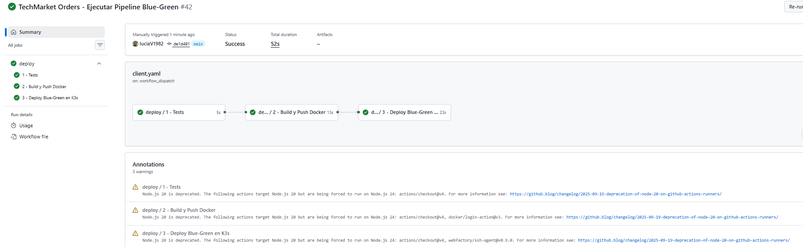

---

## Pipeline completamente exitoso

La siguiente evidencia muestra el resultado final del workflow reutilizable ejecutando correctamente todas las etapas del proceso de Integración y Entrega Continua.

Se observa la ejecución satisfactoria de:

- pruebas automatizadas;
- construcción de la imagen Docker;
- publicación de la imagen;
- despliegue del ambiente candidato;
- validación de salud;
- promoción a producción;
- validación final;
- visualización del estado del clúster.

### Evidencia

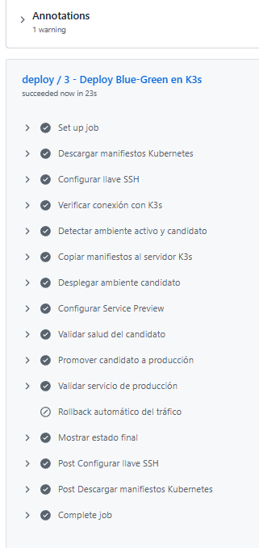

---

---

# ☁️ Validación del despliegue en AWS

Una vez finalizado el proceso de Integración y Entrega Continua, se verificó que la aplicación quedara correctamente desplegada sobre una instancia **Amazon EC2** ejecutando un clúster **Kubernetes K3s**.

Las validaciones realizadas permitieron comprobar que toda la infraestructura quedó operativa y que el pipeline automatizó correctamente el despliegue de la aplicación sobre AWS.

Durante la validación se confirmó:

- Instancia Amazon EC2 en estado **Running**.
- Nodo Kubernetes K3s en estado **Ready**.
- Deployments **Blue** y **Green** en ejecución.
- Services de **Producción** y **Preview** correctamente publicados.
- Acceso exitoso al microservicio mediante la dirección IP pública de la instancia EC2 utilizando los puertos NodePort configurados.

Estas verificaciones evidencian que la integración entre **GitHub Actions**, **Docker**, **Kubernetes K3s** y **AWS** fue implementada correctamente, permitiendo realizar despliegues automáticos sobre infraestructura Cloud.

---

## Evidencias

### Instancia Amazon EC2 en ejecución

La siguiente evidencia muestra la instancia utilizada para el laboratorio ejecutándose correctamente en AWS.

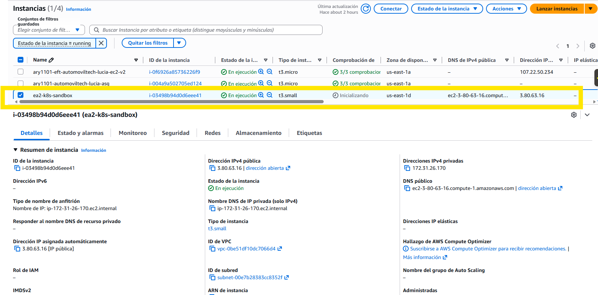

---

### Validación del Service de Producción

Se verificó el acceso al Service de Producción utilizando la IP pública de la instancia EC2 y el puerto **30090**, obteniendo una respuesta correcta del microservicio desplegado.

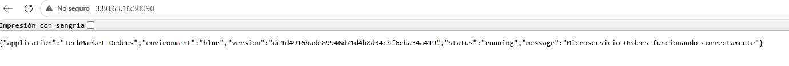

---

### Validación del Service Preview

Posteriormente se comprobó el funcionamiento del Service Preview utilizando el puerto **30091**, confirmando la disponibilidad del ambiente de previsualización.

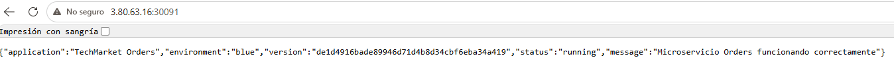

---

### Estado del clúster Kubernetes

Finalmente se verificó el estado del clúster ejecutando comandos de administración de Kubernetes, confirmando que el nodo se encontraba en estado **Ready**, los Pods en ejecución (**Running**) y los Services correctamente publicados.

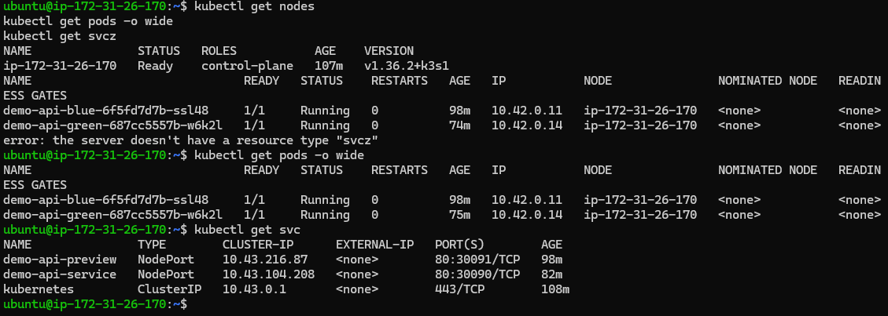

# 🔄 Rollback automático

Como parte de la estrategia Blue-Green, se implementó un mecanismo de **Rollback Automático** para restaurar el ambiente estable si alguna de las validaciones críticas falla durante el proceso de despliegue.

A diferencia de un despliegue tradicional basado en `RollingUpdate`, la solución desarrollada utiliza dos ambientes completamente independientes (**Blue** y **Green**). Debido a ello, la recuperación no consiste en revertir un Deployment, sino en redirigir nuevamente el tráfico del **Service de Producción** hacia el ambiente que anteriormente se encontraba operativo.

## Funcionamiento

El pipeline ejecuta la siguiente lógica:

1. Despliega la nueva versión en el ambiente candidato.
2. Configura el Service Preview.
3. Ejecuta el Health Check sobre el endpoint `/health`.
4. Promueve el ambiente candidato a producción.
5. Ejecuta una segunda validación sobre el Service de Producción.
6. Si cualquiera de las validaciones falla, el workflow ejecuta automáticamente el paso **Rollback automático del tráfico**, restaurando el selector del Service hacia el ambiente estable.

Esta estrategia reduce considerablemente el tiempo de recuperación y evita que una versión defectuosa permanezca atendiendo solicitudes de los usuarios.

---

# 📊 Estado final del clúster

Una vez finalizado el despliegue se verificó el estado de los recursos Kubernetes para confirmar el correcto funcionamiento de la solución implementada.

Las validaciones incluyeron:

- estado de los Pods;
- estado de los Services;
- asociación correcta entre Services y Deployments;
- disponibilidad del endpoint `/health`.

Las comprobaciones confirmaron que la aplicación quedó correctamente desplegada y disponible para recibir tráfico de producción.

## Evidencias

### Pods en ejecución

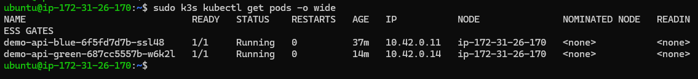

### Services de Kubernetes

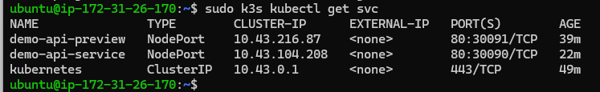

### Validación del endpoint de producción

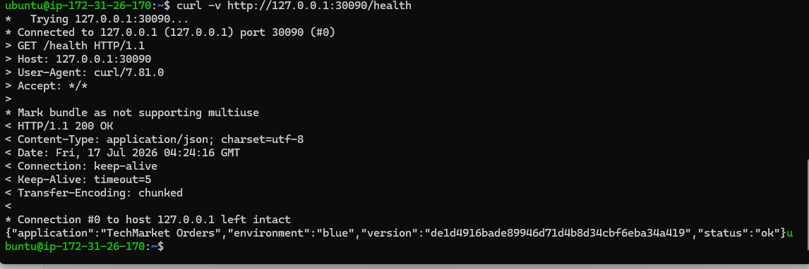

### Rollback implementado en el workflow

La siguiente evidencia muestra que el pipeline incorpora un mecanismo de rollback automático. Durante esta ejecución el paso aparece como **Skipped**, ya que todas las validaciones finalizaron correctamente y no fue necesario restaurar el ambiente anterior.

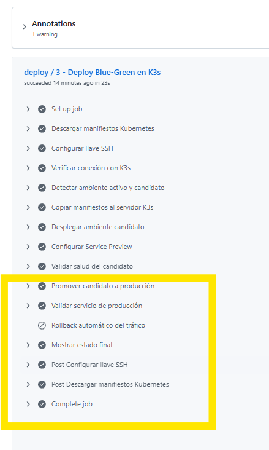

---

# 📚 Referencias

- Docker Inc. (2025). *Docker Documentation*. https://docs.docker.com/

- GitHub. (2025). *GitHub Actions Documentation*. https://docs.github.com/actions

- Kubernetes Authors. (2025). *Kubernetes Documentation*. https://kubernetes.io/docs/

- Amazon Web Services. (2025). *Amazon EC2 Documentation*. https://docs.aws.amazon.com/ec2/

- Amazon Web Services. (2025). *Amazon Elastic Kubernetes Service (EKS)*. https://docs.aws.amazon.com/eks/

- Node.js Foundation. (2025). *Node.js Documentation*. https://nodejs.org/docs/latest/api/

---

# 🤖 Declaración de uso de IA

Para el desarrollo de esta evaluación se utilizó **ChatGPT (OpenAI)** como herramienta de apoyo para la revisión de documentación técnica, organización de contenidos, resolución de dudas conceptuales, mejora de la redacción y apoyo durante el proceso de implementación y documentación del proyecto.

Todas las decisiones de diseño, configuración, validación y pruebas fueron revisadas, comprendidas y ejecutadas por la estudiante antes de incorporarlas al proyecto.

---

# ✅ Conclusiones

Durante el desarrollo de esta Evaluación Final Transversal se logró transformar un proceso de despliegue tradicional en una estrategia de entrega continua mucho más robusta, automatizada y resiliente, integrando los conocimientos adquiridos durante el semestre en torno a GitHub Actions, Docker, Kubernetes y prácticas DevOps.

Se implementó un pipeline reutilizable mediante **GitHub Actions**, capaz de ejecutar pruebas automatizadas, construir y publicar imágenes Docker, desplegar la aplicación en un clúster **Kubernetes K3s** sobre Amazon EC2, aplicar una estrategia **Blue-Green** y validar automáticamente el estado de la nueva versión antes de promoverla a producción.

Como parte de la estrategia de despliegue, se incorporó un **Service Preview** para validar el ambiente candidato mediante el endpoint `/health`, evitando afectar la versión que se encuentra atendiendo tráfico de producción. Además, se implementó un mecanismo de **Rollback Automático**, preparado para restaurar el ambiente estable si alguna validación crítica falla durante el proceso de despliegue.

Las múltiples ejecuciones exitosas del pipeline permitieron comprobar tanto el despliegue inicial como la transición entre los ambientes **Blue** y **Green**, verificando el correcto funcionamiento de la automatización, la disponibilidad del servicio y la capacidad del sistema para soportar despliegues repetibles sin interrupciones.

Finalmente, el proyecto permitió consolidar competencias relacionadas con la automatización de procesos CI/CD, la administración de aplicaciones sobre Kubernetes, la implementación de estrategias modernas de despliegue y la incorporación de mecanismos de resiliencia orientados a reducir el riesgo durante la publicación de nuevas versiones en producción.